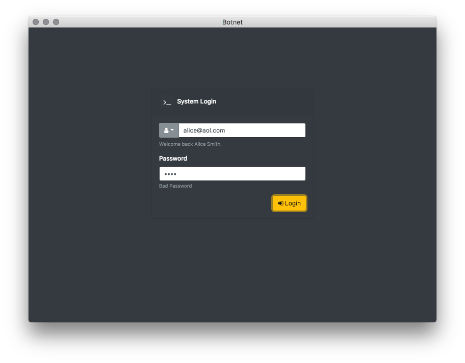
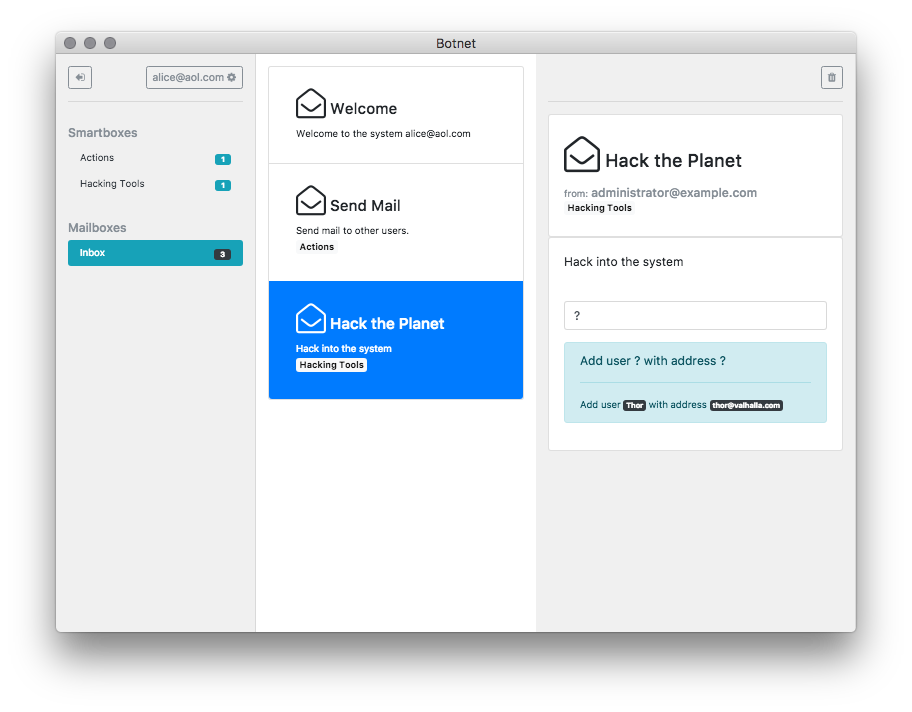
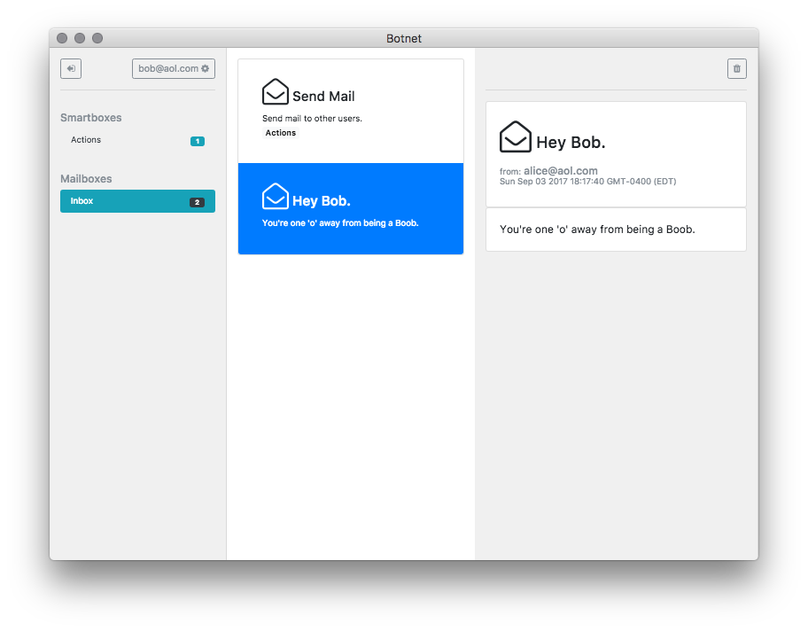

# Botnet
Electron based communication program driven by robotic network entities inspired by email and robots.

Aim of this project is to create a low overhead Mechanical Turk for simple human oriented task processing.

---






## Using this project

```
  npm i -g epx;
  epx botnet;

```

## Todo

- Purge unlinked files (messages)
